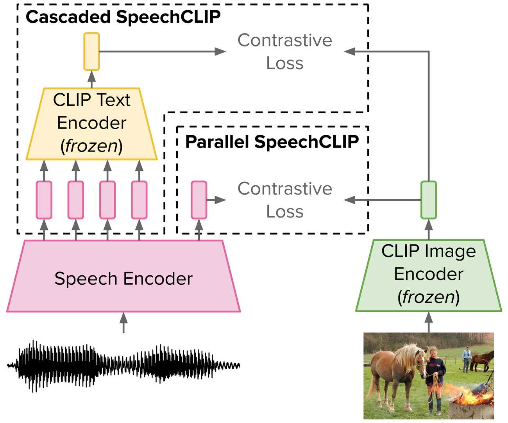

# SpeechCLIP

<p align="center">
    
    <br/>
    <a href=""> </a>
    <a href=""> </a>
    <a href="https://github.com/atosystem/SpeechCLIP/issues"></a>
    <a href="https://github.com/atosystem/SpeechCLIP/pulls"></a>
</p>

Links: [arXiv](https://arxiv.org/abs/2210.00705 ) | [Blog](https://atosystem.github.io/blogs/speechclip)

## Code Contributors

Yi-Jen Shih, Hsuan-Fu Wang, Heng-Jui Chang

## Prequisite

### Install packages
```bash
pip install -r requirements.txt
```

### Data Preparation
See [Details](data/README.md)

### Download Pretrained Checkpoints
```bash
bash download_ckpts.sh
``` 
You chould see `Done downloading all checkpoints` after the script is executed

> Notice that it reuqires 2 GPUs for training base models and 4 GPUs for large models

## Usage
Remember to check the `dataset_root`
### Train

Example: train Parallel SpeechCLIP base:

```bash
bash egs/model_base/parallel/train.sh
```

### Inference

Example: test Parallel SpeechCLIP base:
(Using pretrained checkpoint)
```bash
bash egs/model_base/parallel/test.sh
```

> For more settings, please see the folders in `./egs/`.

### Getting embeddings from SpeechCLIP

See [example.py](example.py)

## Citation
```
@article{speechclip2022,
  title={SpeechCLIP: Integrating Speech with Pre-Trained Vision and Language Model},
  author={Yi-Jen Shih and Hsuan-Fu Wang and Heng-Jui Chang and Layne Berry and Hung-yi Lee and David Harwath},
  journal={IEEE SLT},
  year={2022},
  publisher={IEEE}
}
```

## Contribute
Please run autoformatter before opening PR!
Autoformat `./dev-support/`
